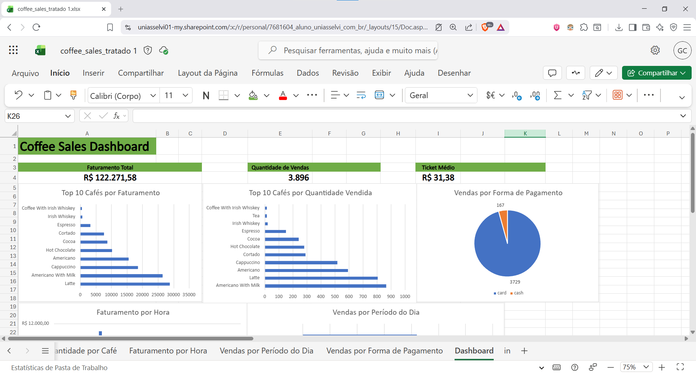
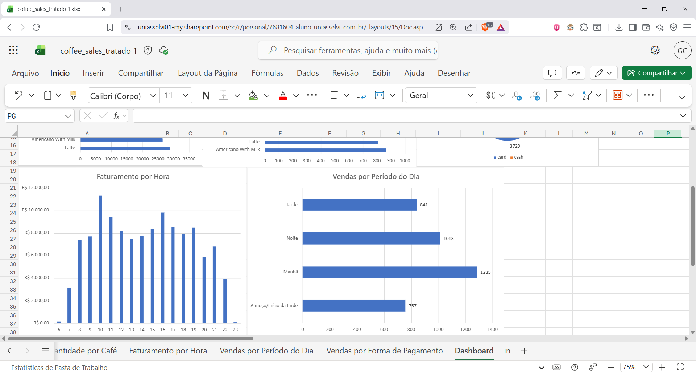

# Coffee Sales Data Analysis

Projeto de análise de vendas de cafeteria, passando por tratamento de dados com Python/Pandas e criação de dashboard no Excel.

O objetivo do projeto foi praticar o fluxo completo de análise de dados: importar bases, limpar e padronizar informações, criar colunas auxiliares, gerar resumos analíticos e construir visualizações para facilitar a interpretação dos resultados.

## Tecnologias utilizadas

- Python
- Pandas
- Jupyter Notebook
- Excel
- Tabelas Dinâmicas
- Gráficos
- GitHub

## Arquivos utilizados

As bases originais utilizadas no projeto foram:

- `index_1.csv`
- `index_2.csv`

Após o tratamento, foram gerados os seguintes arquivos:

- `coffee_sales_tratado.csv`
- `resumo_cafe.csv`
- `resumo_hora.csv`
- `resumo_dia_semana.csv`
- `resumo_periodo.csv`
- `resumo_pagamento.csv`
- `coffee_sales_dashboard.xlsx`

## Etapas do tratamento de dados

O tratamento dos dados foi realizado em Python utilizando a biblioteca Pandas.

Principais etapas realizadas:

- Importação dos arquivos CSV
- Verificação de tamanho das bases, tipos de dados e valores nulos
- Padronização das colunas entre as bases
- União dos DataFrames com `pd.concat()`
- Conversão de colunas de data e horário
- Criação de colunas auxiliares como ano, mês, dia, hora e dia da semana
- Padronização dos nomes dos cafés
- Tratamento dos valores nulos da coluna de cartão
- Criação da coluna de período do dia
- Remoção de duplicatas
- Criação de tabelas resumidas com `groupby()` e `agg()`

## Dashboard

O dashboard foi criado no Excel com base nos dados tratados e nas tabelas resumidas.

Ele contém indicadores e gráficos sobre:

- Faturamento total
- Quantidade total de vendas
- Ticket médio
- Top 10 cafés por faturamento
- Top 10 cafés por quantidade vendida
- Faturamento por hora
- Vendas por período do dia
- Vendas por forma de pagamento

### Visão geral do dashboard





## Principais insights

Alguns insights encontrados durante a análise:

- O café com maior faturamento foi o **Latte**.
- O café com maior quantidade de vendas foi o **Americano With Milk**.
- O cartão foi a principal forma de pagamento utilizada.
- O período da manhã concentrou o maior volume de vendas.
- O horário de 10h apresentou o maior pico de faturamento.
- O produto mais vendido não foi necessariamente o produto com maior faturamento, mostrando diferença entre volume de vendas e ticket médio.

## Estrutura do projeto

```text
coffee-sales-data-analysis/
│
├── analise_coffee_sales.ipynb
├── coffee_sales_dashboard.xlsx
├── coffee_sales_tratado.csv
├── index_1.csv
├── index_2.csv
├── resumo_cafe.csv
├── resumo_dia_semana.csv
├── resumo_hora.csv
├── resumo_pagamento.csv
├── resumo_periodo.csv
├── dashboard_coffee_sales_1.png
├── dashboard_coffee_sales_2.png
└── README.md
